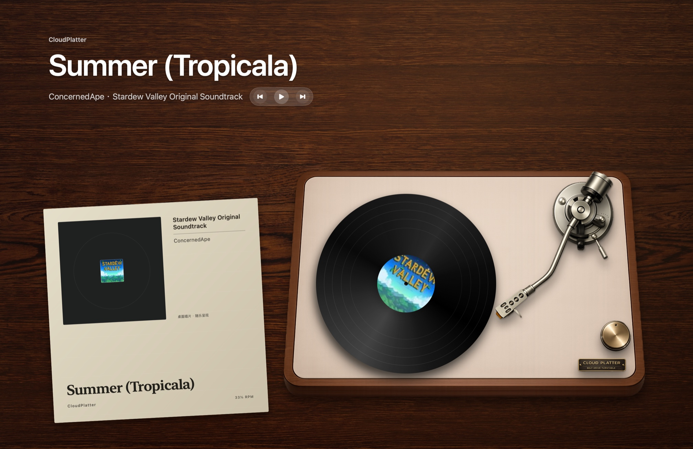

# CloudPlatter

[English](README.en.md)

[](https://github.com/Chengyunlai/cloud-platter/actions/workflows/ci.yml)

当你在 Mac 上播放网易云音乐时，CloudPlatter 会把桌面变成一张随音乐变化的全屏胡桃木唱机
场景，让当前歌曲的封面、黑胶和唱臂成为桌面背景的一部分。

你可以继续使用熟悉的网易云音乐客户端：CloudPlatter 读取本机 Now Playing 信息，并提供上一首、
播放/暂停和下一首三个桌面按钮；它不替代播放器、不要求再次登录音乐账号，也不上传你的收听记录。

## 界面预览



截图直接来自 CloudPlatter 的全屏桌面层；桌面图标、Dock 和其他应用窗口未包含在画面中。

## 安装与使用

### 使用条件

- macOS 14 或更高版本，支持 Apple 芯片和 Intel Mac
- 已安装网易云音乐 macOS 客户端
- 当前动态兼容性验证环境为 macOS 26.3 与网易云音乐 3.1.9；其他版本可能需要进一步验证

### 下载公开安装包

优先打开 [GitHub Releases](https://github.com/Chengyunlai/cloud-platter/releases)。如果页面已经提供
版本，请下载 `CloudPlatter-*-universal.zip` 及同名 `.sha256` 文件，并可在终端验证完整性：

```bash
shasum -a 256 -c CloudPlatter-*.zip.sha256
```

解压后，把 `CloudPlatter.app` 拖入“应用程序”文件夹。公开版本使用 ad-hoc 签名且未经 Apple
公证；第一次打开时，请在 Finder 中右键应用并选择“打开”，或前往“系统设置 → 隐私与安全性”
点击“仍要打开”。只应对从本仓库下载并完成校验的安装包执行此操作，不需要全局关闭 Gatekeeper。

如果 Releases 页面暂时还没有安装包，可以从源码生成当前预览版：

```bash
xcode-select --install             # 已安装 Command Line Tools 时可跳过
brew install cmake                 # 也可以使用其他方式安装 CMake
git clone --recurse-submodules https://github.com/Chengyunlai/cloud-platter.git
cd cloud-platter
make package VERSION=0.1.0-dev
open dist/CloudPlatter.app
```

### 开始使用

1. 启动网易云音乐，并正常播放一首歌曲。
2. 启动 CloudPlatter；它会常驻菜单栏，并自动在每块显示器上显示胡桃木唱机场景。
3. 场景位于桌面图标和普通应用窗口下方。最小化窗口或使用 macOS“显示桌面”即可看到完整效果。
4. 歌手信息右侧提供上一首、播放/暂停和下一首三个按钮；每次控制前都会确认当前媒体仍来自
   网易云音乐。
5. 点击菜单栏中的唱片图标或当前曲目名称，可以查看识别状态、打开设置或退出应用。

CloudPlatter 不需要“辅助功能”或“屏幕与系统音频录制”权限，也不需要再次登录网易云音乐账号。

### 没有显示歌曲时

- 先确认网易云音乐正在播放，并且 macOS“控制中心”的媒体卡片能看到同一首歌曲。
- 如果刚切换过其他播放器，请回到网易云音乐重新开始播放，让它成为系统当前媒体来源。
- 依次重启 CloudPlatter 和网易云音乐。应用会安全降级，不会为了读取信息要求关闭系统安全机制。
- 仍无法使用时，请带上 macOS 与网易云音乐版本到
  [Issues](https://github.com/Chengyunlai/cloud-platter/issues) 反馈；不要上传账号、Cookie 或完整收听记录。

## 项目状态

目前处于技术验证和原型阶段。已在 macOS 26.3 与网易云音乐 3.1.9 上验证实时读取标题、
艺人、专辑、封面、播放状态和切歌更新；仍需完成更多内容类型、客户端重启和系统版本的
兼容性验证。

## MVP 规划

- 识别网易云音乐的播放、暂停和切歌状态
- 显示当前歌曲标题、艺人、专辑和封面
- 在每块显示器上渲染点击穿透的全屏动态唱机桌面
- 在桌面使用上一首、播放/暂停和下一首控制当前网易云音乐
- 通过菜单栏控制显示、登录时启动和减少动态效果
- 全程在本机运行，无需再次登录网易云音乐账号

## 技术方向

- 使用 Swift 和 AppKit 构建 macOS 应用与位于桌面层的多显示器全屏窗口
- 使用 SwiftUI 和 Core Animation 构建设置界面与唱机动画
- 使用可替换的播放状态源，由系统 `/usr/bin/perl` 子进程加载隔离的 MediaRemote helper；
  事件流为空、不可用或静默超时后先执行一次性 MediaRemote 快照，仍无结果时再由
  `/usr/bin/osascript` 按需执行网易云定向查询
- 在应用边界过滤网易云音乐来源，并把私有字段转换为项目自己的播放状态
- 发送播放命令前即时复核当前来源，避免控制其他播放器
- 通过 GitHub Releases 提供可下载的安装包

默认读取路径及按需备用路径都不需要“辅助功能”或“屏幕与系统音频录制”权限，也不会上传
收听记录。它们依赖 Apple 未公开的 MediaRemote 行为以及 macOS 当前附带的 `/usr/bin/perl`
和 `/usr/bin/osascript`，可能随系统更新
失效，不适合通过 Mac App Store 分发；应用会先自检并在不兼容时安全降级。未经签名和公证的下载版本，也可能需要你在
macOS“隐私与安全性”设置中手动允许打开。详细技术边界见
[ADR-0004](docs/adr/0004-isolated-mediaremote-adapter.md)。

## 开发与贡献

项目以中文作为默认文档语言，英文文档作为同步翻译。代码标识符使用英文，代码注释使用中文。完整规范请阅读 [CONTRIBUTING.md](CONTRIBUTING.md)。

```bash
git submodule update --init --recursive
make check
make adapter
make package VERSION=0.1.0-dev
```

- [项目路线图](docs/ROADMAP.md)
- [领域上下文](CONTEXT.md)
- [架构决策](docs/adr/README.md)
- [播放状态源技术调研](docs/research/now-playing-data-source-2026-08.md)
- [macOS 26.3 / 网易云音乐 3.1.9 兼容矩阵](docs/compatibility/macos-26-netease-3.1.9.md)
- [第三方软件声明](THIRD_PARTY_NOTICES.md)
- [安全政策](SECURITY.md)

## 独立项目声明

CloudPlatter 是独立、非官方的开源项目，与网易云音乐、Apple 或 Vinyl for Mac 没有从属、合作或背书关系。相关产品名称和作品版权归各自权利人所有。

## 许可证

[MIT](LICENSE)
